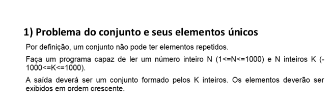

# Description

In this sample application, you will execute an api using Django and Django Rest Framework, with standard best practices and respecting the rules.

# Digistarts Api
<br>
<div>

</div>
<br>

This app contains an opinionated set of endpoints for web server:


## Steps

### Execute web service
You can get started building this application locally, but you can either run the application in web using the heroku link host web (http://digistartsapi.herokuapp.com).

### Building Locally


### This project requires
```bash
* virtualenvwrapper, pyenv virtualenv or virtualenv for local development
* python >= 3.8
* Install [Python](https://www.python.org/downloads/)
```

### Edit your .env file to use your settings
```bash
$ cp dev.env .env

DEBUG=your_debug
SECRET_KEY=you_key
DATABASE_URL=your_database_info
```

### Install e configure your postgres database
```bash
PostgreSQL 9.3+
Create an user and a database in local PostgreSQL for local development:
sudo apt-get install postgresql-client postgresql postgresql-server-dev

$ sudo -u postgres createuser --createdb [youruser] -sP
$ sudo -u postgres createdb [yourdb] -O supplai_api
```

### Running Django applications: You can download the project dependencies with:

```bash
pip install -r dev-requirements.txt
python manage.py migrate
```

### Run your application locally:

```bash
python manage.py runserver
```

### Test your endpoints with pytest:

```bash
pytest teste_pytest.py
```

### Your application will be running locally with a doc api  on main page. 

